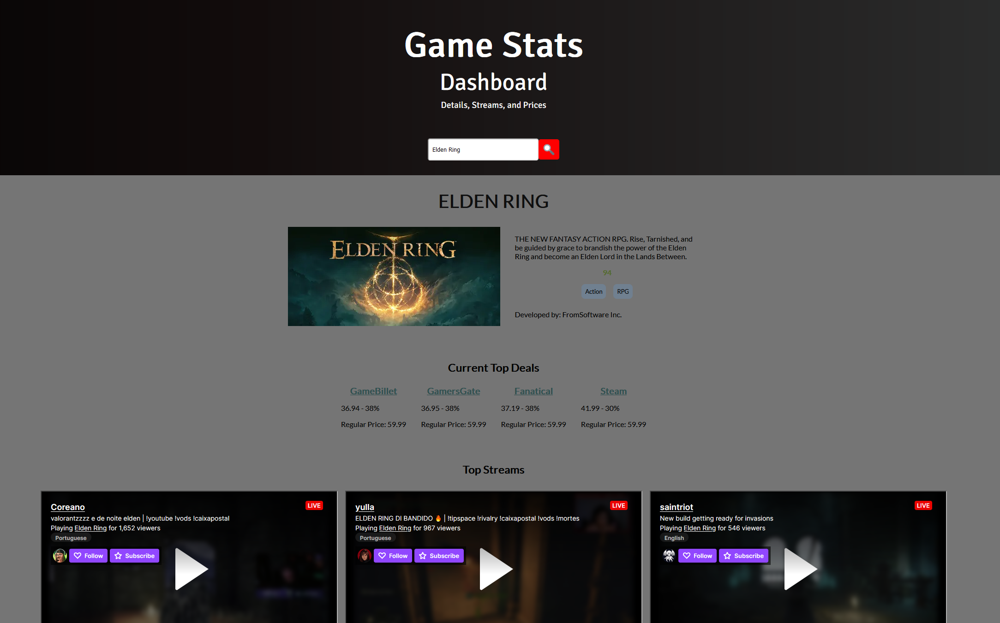

# 🎮 Game Hunter

Game Hunter is a web application that allows users to search for and learn about their favorite games. Built with Next.js, the application makes requests to Steam, Twitch, and isthereanydeal to gather data about the game and displays it to the user on the page.

The main goal of the project was to learn about testing principles, and as such, the application includes tests written with Jest and Cypress. These tests ensure that the application functions correctly and that the data displayed to the user is accurate. While initially focusing on testing the initial form input with Jest, the project eventually transitioned to using only Cypress for testing, using JavaScript instead of TypeScript to become more familiar with the primary language used with Cypress and following online resources that used Javascript, such as YouTube channels like Fireship. These tests ensure that the application functions correctly and that the data displayed to the user is accurate.

During the development of the project, there were some issues encountered with the Steam API, including being rate-limited or blocked. These issues were likely caused by errors in the tests written for the application.

## 🚀 Getting Started

To run the project locally, follow these steps:

1. Clone the repository to your local machine.
2. Navigate to the root directory of the project.
3. Run `npm install` to install the necessary dependencies.
4. Run `npm run dev` to start the development server.
5. Visit `http://localhost:3000` in your web browser to view the application.

## 💻 Technologies

- Next.js: a JavaScript framework for building server-rendered or statically-exported React applications.
- Cypress: a JavaScript-based end-to-end testing framework.
- TypeScript: A typed superset of JavaScript that compiles to plain JavaScript.